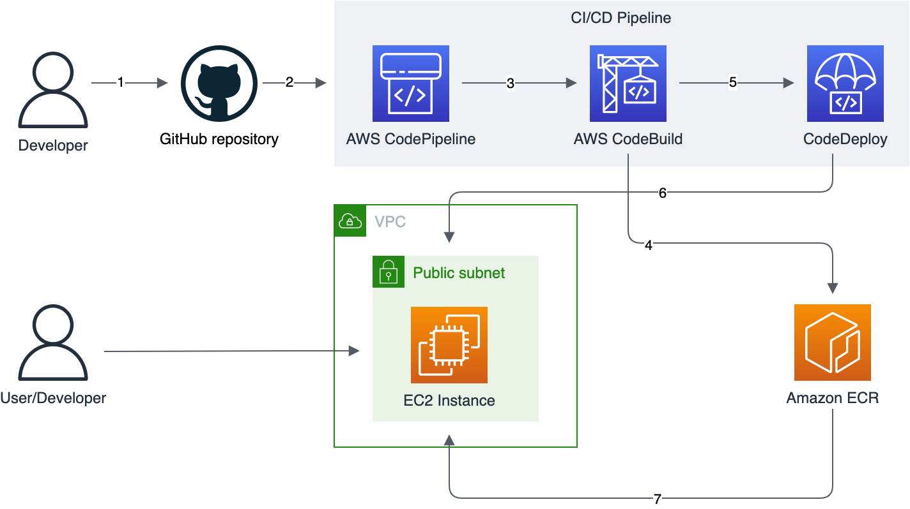

# minimal-flask-app-cicd

A complete CDK project for deploying an end-to-end CI/CD pipeline and infrastructure for a minimal Python Flask application. **Quick-start Flask application included!**

## Table of Contents

- [Overview](#overview)
    - [Architecture](#architecture)
- [Getting Started](#getting-started)
    - [Prerequisites](#prerequisites)
    - [Configuring](#onfiguring)
    - [Built-in Flask application](#built-in-flask-application)
    - [Deploying](#deploying)

## Overview
This CDK project creates a CI/CD pipeline and a single EC2 instance that hosts a database and to which a Flask application is deployed automatically. The aim of the project is to be minimalistic and low cost. It is ideal for people who want to spin up a testing set up for their Flask web app in AWS with minimum spend.

The project includes a quick-start Flask application with some useful extensions and a DB model already created. Ideal for getting up and running quickly.

### Architecture
<a href="https://github.com/prefabric/python-ecs-cicd/blob/master/documentation/scaffold.png"></a>

Workflow:
1. Code is pushed to the GitHub repository
2. The GitHub hook triggers the CodePipeline pipeline
3. CodePipeline starts the CodeBuild project which runs the tests, linters and builds the docker image
4. The built docker image is pushed to the ECR repository
5. CodePipeline triggers CodeDeploy
6. CodeDeploy runs the deployment scripts on the instance, including DB migrations
7. The new version of the Flask app docker image is pulled, built and started

> **Warning**
> - There is some downtime when deploying to the instance
> - Terminating the instance will destroy the database. Enable snapshots if you care about the data.


## Getting Started

These instructions will guide you through deploying the pipeline and your application to a region in your AWS account.

### Prerequisites

You will need the following to deploy the CDK app:
- [AWS CLI](https://docs.aws.amazon.com/cli/latest/userguide/cli-chap-getting-started.html) installed and configured with your AWS account and region
- [AWS CDK v2](https://docs.aws.amazon.com/cdk/v2/guide/getting_started.html) installed and [bootstrapped](https://docs.aws.amazon.com/cdk/v2/guide/getting_started.html) for the account and region you are deploying to
- Grant AWS access to GitHub using an access token:

    - Create a [GitHub access token](https://docs.github.com/en/authentication/keeping-your-account-and-data-secure/creating-a-personal-access-token) with scope `repo` and `admin:repo_hook`
    - A [Secrets Manager Secret](https://docs.aws.amazon.com/secretsmanager/latest/userguide/managing-secrets.html) with the value of the access token

### Configuring
The CDK app can be configured by modifying `cdk.context.json`, more specifically the variables inside the `scaffold_config` property.  

| Property           | Comment                                                                                            |
|--------------------|----------------------------------------------------------------------------------------------------|
| app_name           | The name of your application. Used to name various AWS resources                                   |
| github_secret_name | The name of the Secrets Manager secret you created to store your GitHub access token               |
| source             | The location of the CDK app and Python app repository that will be used as source for the pipeline |
| cidr               | The IPv4 CIDR block for the staging and production VPCs                                            |
| max_azs            | Maximum number of availability zones in each VPC.                                                  |
| nat_gateways       | Number of NAT gateways in each VPC                                                                 |

### Built-in Flask application
The project comes with a functional dockerized Python Flask application located in `flask_app/`. Dependencies are located in `requirements.txt` and the `Dockerfile` describes how to build and image. The `docker-compose.yml` file spins up the app and a local DB.

Some features included in the Flask app:
- DB integration and model
- DB migrations configured
- Log in extension configured
- Prod and Dev config file
- Blueprints are set up
- Templating is set up with [Bootstrap](https://getbootstrap.com)

### Deploying

After completing the prerequisite steps and configuring the CDK app you are ready to deploy.

To deploy the CDK app run:

```
cdk deploy --all
```

This will deploy the pipeline infrastructure, EC2 instance and supporting infrastructure. After deployment completes the pipeline will be trigger with the source code of your application and your application deployed.
